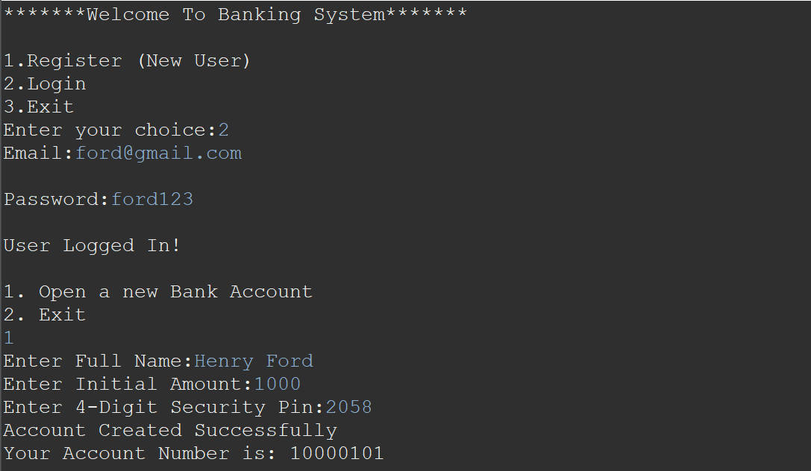

# Banking System Application



## Overview

The Banking System Application is a Java-based application that utilizes JDBC to interact with a MySQL database as its backend. The application provides users with essential banking functionalities, including user registration, login, account management, and transaction handling.

## Functionalities

### 1. User Registration

- **Description:** New users can register by providing personal information.
- **Workflow:**
  1. User selects the "Register" option.
  2. Enters personal details (name, email,password etc.).
  4. The application verifies and adds the new user to the database.

### 2. User Login

- **Description:** Registered users can log in to access their accounts.
- **Workflow:**
  1. User selects the "Login" option.
  2. Enters the username and password.
  3. The application verifies credentials and grants access to the user's account.

### 3. Open New Bank Account

- **Description:** Logged-in users can open a new bank account.
- **Workflow:**
  1. User selects the "Open New Account" option.
  3. Receives a new account number and ATM PIN.
  4. The account details are stored in the database.

### 4. Debit, Credit, Transfer

- **Description:** Users can perform financial transactions within their accounts.
- **Workflow:**
  1. User selects the "Debit," "Credit," or "Transfer" option.
  2. Enters the necessary details (amount, destination account for transfer, etc.).
  3. The application processes the transaction and updates the account balance.

### 5. Check Balances

- **Description:** Users can check the balances of their accounts.
- **Workflow:**
  1. User selects the "Check Balances" option and provide the ATM Pin.
  2. The application retrieves and displays the account balances.

## Installation

1. **Java Development Kit (JDK):** Ensure you have Java installed on your system.
2. **MySQL Connector/J:** Download and install the MySQL Connector/J from [MySQL Downloads](https://dev.mysql.com/downloads/connector/j/).
3. **Add Connector to Classpath:** Add the MySQL Connector/J JAR file to your project's classpath.

## Database Setup

1. **Create Database:** Run the SQL script provided to create the necessary database and tables.
2. **Configure Connection:** Update the JDBC connection details in your Java code.

## Running the Application

1. Compile and run the Java application.
2. Follow the on-screen prompts to navigate through the functionalities.

## Dependencies

- Java
- MySQL Database
- MySQL Connector/J

## Conclusion

The Banking System Application offers a user-friendly interface for users to manage their accounts effectively. With features like user registration, account creation, and transaction handling, it provides a comprehensive solution for banking operations.


```Java

//sample java code
switch(choice1) {
		case 1:
  		user.register();
			break;
				
		case 2:
			email = user.login();
          if(email!=null){
             System.out.println();
             System.out.println("User Logged In!");
                        
             if(!account.account_Exists(email)){
                        	
                 System.out.println();
                 System.out.println("1. Open a new Bank Account");
                 System.out.println("2. Exit");
                 if(sc.nextInt() == 1) {
                    account_number = account.openAccount(email);
                    System.out.println("Account Created Successfully");
                    System.out.println("Your Account Number is: " + account_number);
                 }
                 else
                {
                    break;
                 }
             }
                  account_number = account.get_AccountNumber(email);
                  int choice2 = 0;
                  while (choice2 != 5) {
                     System.out.println();
                     System.out.println("1. Debit Money");
                     System.out.println("2. Credit Money");
                     System.out.println("3. Transfer Money");
                     System.out.println("4. Check Balance");
                     System.out.println("5. Log Out");
                     System.out.println("Enter your choice: ");
                     choice2 = sc.nextInt();
                     switch (choice2) {
                       case 1:
                           AccountManager.debutMoney(account_number);
                           break;
                       case 2:
                           	AccountManager.creditMoney(account_number);
                            break;
                       case 3:
                           	AccountManager.transferMoney(account_number);
                            break;
                       case 4:
                           	AccountManager.getBalance(account_number);
                            break;
                       case 5:
                            break;
                       default:
                            System.out.println("Enter Valid Choice!");
                            break;
                            }
                        }

                    }
            else{
                 System.out.println("Incorrect Email or Password!");
                }
          case 3:
           	System.out.println("Exiting System!");
           	System.out.println("THANK YOU FOR USING BANKING SYSTEM!!!");
                    
             return;
          default:
            System.out.println("Enter Valid Choice");
              break;
}
